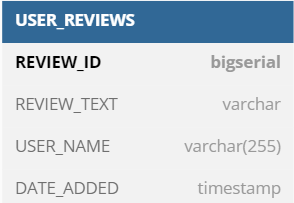
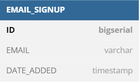

# Decision-Making Framework
# Description
Welcome to our project!
This is a decision making framework made in React and JavaScript. This software allows users to quickly and easily choose the most appropriate voting method.
The application will assist charities in making decisions that will help their organizations. This application will also help other donors to make more informed decisions about how to help these organizations. This software will make it easier for charities to choose the best courses for their future and will give donors the information they need to make informed decisions."

# Contribution
We welcome any and all contributions! Here are some ways you can get started:
1. report any bug or issues on the project board [Github project board](https://github.com/orgs/Logic-Legends/projects/1/views/1) 
2. Contribute code: If you are a developer and want to contribute, follow the instructions below to get started!

# Instruction
1. clone the repository
2. make your own `feature` branch
3. to get latest changes to your local run `git pull origin <REMOTE ORIGIN BRANCH NAME>`
3. Commit and push
4. Wait for pull request to be merged on ``develop`` branch
5. If make sure you meet DOD, wait for pull request to be merged on `main` branch

# Client-side(React)
# Installation  
1. Navigate to your project directory in the terminal.
2. run `npm install` command 
# Running the Client-side
1. Navigate to the client folder by running `cd client` and then run `npm run dev`
2. or run `npm run dev:client` from the root
(Note : if you get any server error after installaton,make sure about your node version by running `node -v`. you need to have `16.17.0` version of node)

# Server-side(Node.js)
# Installation
1. Navigate to your project directory in the terminal.
2. run `npm install` command 
# Running the Server-side
1. Navigate to the root directory of your project in the terminal.
2. Run the command `npm run dev:server` to start the development server.

# Mail Server
# Installation
1. Navigate to your project directory in the terminal.
2. Run the command `npm install nodemailer` to install Nodemailer

# Database (postgreSQL)
# Installation
1. Run the command `$ sudo apt-get install postgresql postgresql-contrib` for installing postgreSQL
2. Run the command `$ sudo -u postgres createuser -P --createdb <username>` for creating database user
3. Run the command `$ createdb logic-legends` for creating database
4. create a tables by following the tables structure :

# Running Database
1. On your terminal run the command `psql logic-legends`
2. by running the `\d` command you can see the exisiting tables

# Cypress(Testing platform)
# Installation
1. Navigate to your project directory in the terminal.
2. Run the command `npm install cypress --save-dev` to install Cypress.
3. Run the command `npx cypress open` to open cypress.
4. The Cypress Launchpad will guide you through configuring your project.
5. Select E2E configuration

# Configuration
1. Add this lines to `cypress.config.js ` file after `component` object :
        indexHtmlFile: "client/cypress/component-index.html",
		specPattern: "client/**/*.cy.js",
		supportFile: "client/cypress/component.js",
# Runing test
1. To write and run you test you can follow the [Link](https://docs.cypress.io/guides/end-to-end-testing/writing-your-first-end-to-end-test) 
 

# Sample prototype of this project
[prototype](https://www.figma.com/proto/9rJSROPIeYhrtHArqIPWwp/Decision-Making-Framework-Luan?node-id=243%3A173&scaling=min-zoom&page-id=0%3A1&starting-point-node-id=243%3A173)

# Deploy (Render)
we use `Render` for deploying our application. As soon as each changes merge with `develop` branch it will be deployed on `Render`. here is the link https://starter-kit-snzl.onrender.com/

